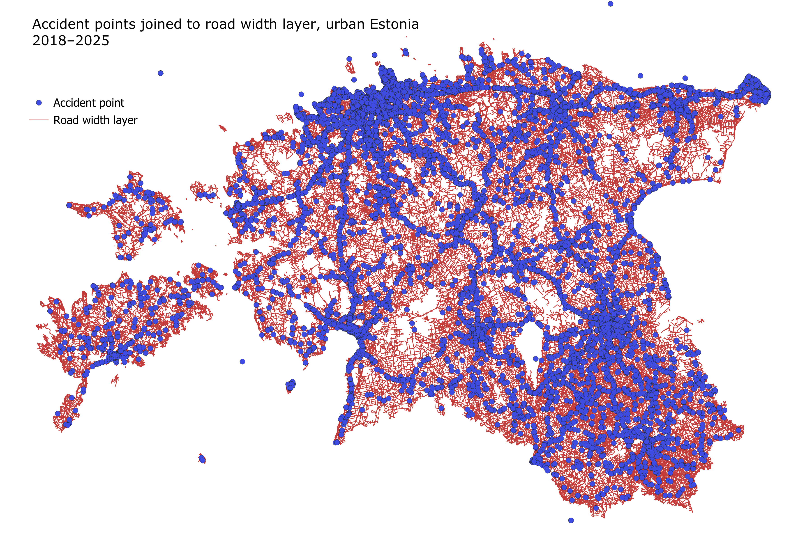
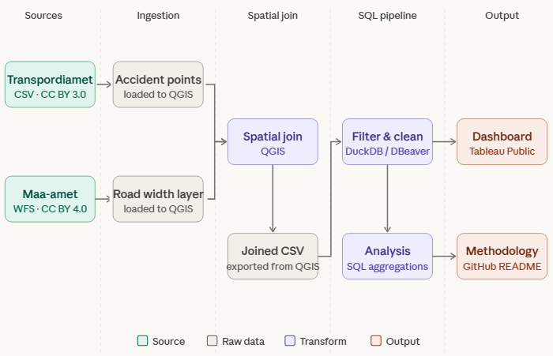
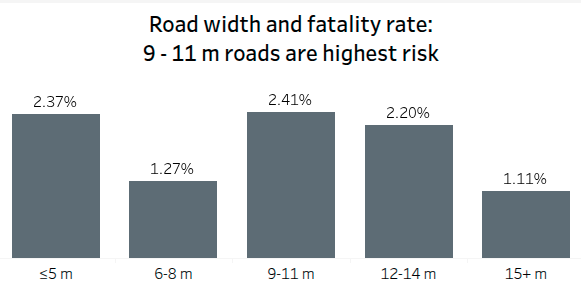
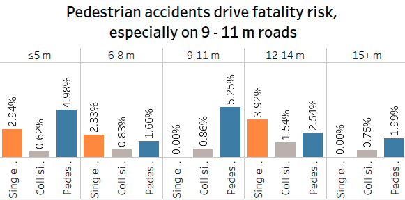
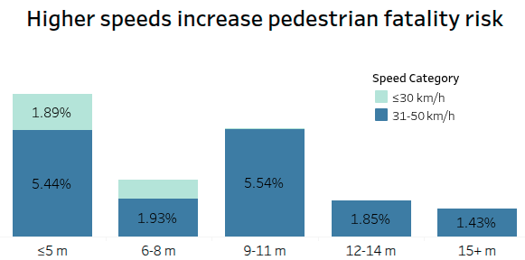
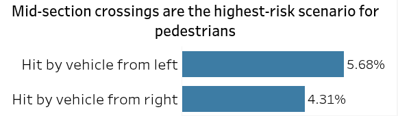
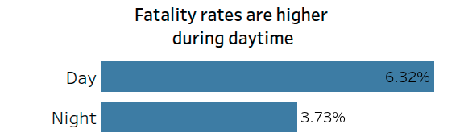

# Road Width vs Accident Severity (Urban Estonia)

Does road width influence accident severity in urban Estonia, or is something else driving the risk?

---

## Terms

| Term | Meaning |
|---|---|
| Fatality rate | Percentage of accidents in a given group that resulted in at least one death. |
| Mid-section / mid-block crossing | A pedestrian crossing point located between intersections, typically without traffic signals. |
| Conflict from left / right | The direction the vehicle approached from, relative to the pedestrian, at the moment of impact. |
| Pedestrian exposure | The degree to which pedestrians are present and interacting with vehicle traffic in a given location. |
| Spatial join | A GIS operation that combines two datasets based on their geographic location rather than a shared ID column. |

---

## Research question

Is there a relationship between road width and traffic accident severity in urban Estonia? The analysis covers accidents involving injuries or fatalities in Estonian cities between 2018 and 2025. Results are presented as aggregated statistics and visualizations to identify patterns, not to establish causation.

---

## Data

#### Road width data

- Dataset: TN.RoadTransportNetwork.RoadWidth. Provider: Eesti topograafia andmekogu - Maa- ja Ruumiamet (Estonian Topographic Database - Republic of Estonia Land and Spatial Development Board)
- Metadata: https://metadata.geoportaal.ee/geonetwork/srv/eng/catalog.search#/metadata/bf38a8fc-96f1-4d34-9130-18160e489514
- Service endpoint (WFS): https://inspire.geoportaal.ee/geoserver/TN_transportetak/wfs, TN.RoadTransportNetwork.Roadwidth
- Accessed: March 2026
- Licence: CC BY 4.0

#### Traffic accident data

- Dataset: Inimkannatanutega liiklusõnnetuste andmed (Traffic accidents with casualties). Provider: Eesti Transpordiamet, via the Estonian Open Data Portal
- Dataset page: https://andmed.eesti.ee/datasets/inimkannatanutega-liiklusonnetuste-andmed
- Accessed: March 2026
- License: CC BY 3.0

#### Spatial data

Accident points joined to road width polygons using a QGIS spatial join (20m).



### Data lineage



---

## Method overview

- Filtered to urban accidents, 2018-2025, involving at least one injury or fatality
- Joined accident points to road width polygons via spatial join (GIS, 20m)
- Classified each accident as fatal (deaths > 0) or non-fatal
- Aggregated by road width, accident type, speed category, crossing scenario, and lighting condition

Full methodology: [Methodology.md](./Methodology.md)

SQL queries used for data cleaning and analysis: [/sql](./sql)

- `sql/cleaning/` — filtering, duplicate removal, null analysis, value standardization
- `sql/analysis/` — fatality rate by width, accident type by width, pedestrian fatality by width/speed/scenario/daytime

---

## Dashboard

https://public.tableau.com/app/profile/aleksandra.doroshenko/viz/Roadwidthvsseverity/Dashboard1

---

## Key insight

Accident severity in urban Estonia is not driven by road width alone, but by the interaction between road width, vehicle speed, and pedestrian exposure — how much pedestrian traffic a road sees and how directly it interacts with vehicles. Pedestrian fatalities peak on 9-11m urban roads, concentrated at mid-block crossings at speeds of 31-50 km/h, with higher risk during daytime.

---

## Findings

#### 1. Fatality risk peaks on medium-width roads (9-11m)



| Width | Fatality rate |
|---|---|
| 9-11 m | 2.41% |
| 6-8 m | 1.27% |
| 15+ m | 1.11% |

Medium-width roads likely combine higher speeds with active pedestrian interaction.

#### 2. Pedestrian accidents drive this pattern



Pedestrian fatality rate at 9-11m roads reaches 5.25%, compared to under 1% for vehicle collisions in the same width category. High pedestrian exposure significantly increases overall fatality risk.

#### 3. Speed amplifies pedestrian fatality risk



Most fatal accidents occur at 31-50 km/h, with a 5.54% fatality rate at 9-11m roads in this speed band. Sample sizes at higher speeds are small. Moderate urban speeds are sufficient to produce high fatality risk when pedestrian exposure is high.

#### 4. Mid-block crossings are the highest-risk scenario



- Struck by vehicle from left: 5.68%
- Struck by vehicle from right: 4.31%

Unprotected, mid-block crossings are key risk points — pedestrians crossing outside signalized intersections face higher fatality rates regardless of approach direction.

#### 5. Daytime conditions show higher fatality rates



- Day: 6.32%
- Night: 3.73%

Likely driven by higher traffic and pedestrian volume during daytime hours, rather than visibility conditions.

#### 6. Narrow roads (≤5m) show a similar pattern, less reliably

Fatality rate reaches roughly 5.4% in some cases, but on a smaller sample than the 9-11m category. The pattern is directionally consistent but less statistically robust, so the focus remains on 9-11m roads as the primary finding.

---

## Repository structure

```
road-width-accident-severity/
├── README.md
├── Methodology.md
├── data/
│   ├── raw_data.csv
│   ├── filtered_data.csv
│   ├── cleaned_data.csv
│   └── map_preview.png
└── sql/
    ├── cleaning/
    │   ├── 01_filtering.sql
    │   ├── 02_duplicates.sql
    │   ├── 03_null_analysis.sql
    │   └── 04_standarize_values.sql
    └── analysis/
        ├── 01_fatality_rate_by_width.sql
        ├── 02_accident_type_by_width.sql
        ├── 03_pedestrian_fatality_by_width.sql
        ├── 04_pedestrian_fatality_by_speed.sql
        ├── 05_pedestrian_fatality_by_scenario.sql
        └── 06_pedestrian_fatality_by_daytime.sql
```

---

## Limitations

- Speed categories are broad (e.g. 31-50 km/h), which limits precision on the speed-risk relationship.
- Sample sizes at higher speed bands are small.
- Road width alone does not capture full road design — lane count, crossing infrastructure, and signal placement are not included in this analysis.

---

## Acknowledgement

AI tools were used during development to help review SQL queries, clarify concepts, and improve documentation. All analysis, data processing, and conclusions were performed and validated by the author.

This project was completed as part of the Data Analysts Advanced Training Program by BCS Koolitus.
